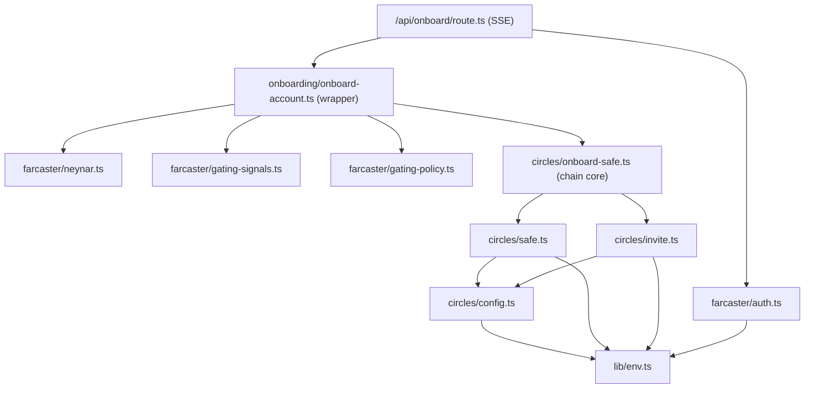

# Architecture

A map of how this repo is laid out and how a request flows through it. If you
are here to learn one of the two flows in depth, read the dedicated guides:

- [Farcaster mini app](./farcaster-mini-app.md) — SDK init, Quick Auth, manifest.
- [Circles invite + Safe](./circles-invite-and-safe.md) — Safe deploy, the invite farm, gating.

## Stack

- **Next.js 16** App Router (Turbopack), **React 19**, **TypeScript** strict.
- **Tailwind v4** + shadcn for the UI.
- **viem** for chain reads/writes; **@safe-global/protocol-kit** for Safe deploy + signing.
- **@aboutcircles/sdk-invitations** for the Circles invite farm.
- **@farcaster/miniapp-sdk** (client SDK) + **@farcaster/quick-auth** (server JWT verify).
- **Neynar v2** for the fid's verified addresses + anti-spam signals.
- Target chain: **Gnosis (chain 100)**. Circles lives on Gnosis.

## Where things live

```
app/
  page.tsx                     entry; renders <OnboardApp/>
  layout.tsx                   <head> metadata + fc:miniapp embed + fonts
  api/
    onboard/route.ts           POST: the onboard flow, streamed as SSE (auth -> deploy -> invite)
    account-status/route.ts    POST: returning-user detector (auth, read-only, fail-open)
    verified-addresses/route.ts GET: the caller's verified eth addresses (signer picker)
    names/route.ts             POST: ENS / basename reverse resolution (cosmetic)
    debug/me/route.ts          GET: token + profile + gate verdict (dev only, no spend)
components/
  onboard-app.tsx              the single-screen client UI (all phases)
hooks/
  use-miniapp-sdk.ts           wraps @farcaster/miniapp-sdk: host detect, ready(), token, wallet
lib/
  env.ts                       env access + validation (single source of truth for config)
  circles/
    config.ts                  Gnosis contract addresses + Circles SDK wiring
    safe.ts                    predict / deploy / assert the user's Safe (deterministic address)
    invite.ts                  the invite farm: preflight, ensureInviterSetup, the atomic claim+transfer
    onboard-safe.ts            REUSABLE chain core: sequences safe+invite, emits progress; no Farcaster
    account-status.ts          PURE CHAIN: findRegisteredSafe(candidates) + positive-only humanCache; no Farcaster
  farcaster/
    auth.ts                    verifyQuickAuth: Bearer JWT -> { fid }
    neynar.ts                  verified addresses + profile via Neynar
    gating-signals.ts          free/keyless anti-spam signals (power badge, mutual follow)
    gating-policy.ts           turns signals + ONBOARD_GATE into allow/block
  onboarding/
    onboard-account.ts         thin Farcaster wrapper: auth/gate/owners, then calls onboard-safe
    detect-account.ts          fid layer: builds candidate owner sets, runs findRegisteredSafe, reads profile/owner status
  types.ts                     shared API + domain types
public/.well-known/farcaster.json   the signed mini app manifest (per prod domain)
```

`lib/circles/config.ts` and `lib/circles/invite.ts` deliberately omit
`import "server-only"` because the `scripts/` tsx helpers import them in plain
Node. Everything else server-side keeps `server-only`.

## The onboard flow

One client tap calls `POST /api/onboard` with a Quick Auth JWT. The server owns
everything from there: it deploys the user's Safe with the operator's gas and
spends the house inviter's prepaid quota to register the user as a Circles human.
The user never signs a transaction or leaves the app. The route **streams**
progress back as Server-Sent Events, so the client's milestones reflect the real
on-chain step instead of a timer.

The flow is split in two: a thin **Farcaster wrapper** (`onboardAccount`) does
the fid-specific work (auth, owner re-validation, the anti-spam gate), then hands
a resolved owner set to the **reusable chain core** (`onboardSafeToCircles`),
which knows nothing about Farcaster, HTTP, or UI and emits semantic
`OnboardProgress` events as it goes.

```mermaid
sequenceDiagram
    autonumber
    participant U as User (in a Farcaster app)
    participant C as OnboardApp (client)
    participant R as /api/onboard (SSE)
    participant W as onboardAccount (Farcaster wrapper)
    participant K as onboardSafeToCircles (chain core)
    participant Gn as Gnosis chain

    U->>C: tap "Create my account"
    C->>R: POST { connectedAddress, additionalOwners } + Bearer JWT
    R->>R: verifyQuickAuth(JWT) -> { fid } (pre-stream; bad token = JSON 401)
    R->>W: onboardAccount({ fid, ..., onProgress })
    W->>W: resolve owners (wallet + re-validated verified addrs)
    W->>W: anti-spam gate (ONBOARD_GATE) — before any spend
    W->>K: onboardSafeToCircles({ owners }, onProgress)
    K->>Gn: predict Safe addr → emit "predicting"
    K->>Gn: Hub.isHuman(safe)? — idempotency short-circuit
    K->>Gn: preflight (read-only) → emit "preflight"
    K->>Gn: deploy + assertSafeReady → emit "deploying"/"verifying"
    K->>Gn: inviteSafe: claim+transfer (atomic) → emit "inviting"
    K->>Gn: poll Hub.isHuman ≤12×/2s → emit "registering"(attempt)
    K-->>W: ChainOnboardOutcome
    Note over R,C: each emit → `data: {type:"progress",...}` SSE frame
    W-->>R: OnboardOutcome → terminal `result` | `error` frame
    R-->>C: text/event-stream (HTTP 200; flow errors carry `code` in-band)
    C->>U: real milestones → "You're in." + Safe address + tx links
```

`onProgress` is a fan-out: the wrapper appends a `chain:` line to the debug
`steps[]` AND forwards the event to the route's SSE sink, so the dev `debug`
trail (`ONBOARD_DEBUG` / non-prod) and the user's milestones come from one source
and cannot drift. A faulty consumer can't stall the chain — the core try/catch
guards every `onProgress` call, and the route keeps the on-chain work running
even if the client disconnects (it just stops enqueuing).

## Returning-user detection

A user who already has a registered Circles Safe should land on a **Manage**
screen, not the "Create my account" CTA — with no gas and no quota spent for the
detection. There is no fid → Safe index (the design is deliberately stateless),
so detection re-derives the Safe address from the user's owners and asks the
chain whether it's already a human.

**Why this isn't "just predict once."** The deployed Safe address is
deterministic for a given owner set, but the *owner set drifts between sessions*:
the default set is `[connectedAddress, ...recommended]`, where `recommended` is
the fid's verified addresses that resolve to an ENS/basename **at request time**.
Name resolution can flip, the verified set can change, and the user may have
hand-toggled signers at onboard. A single re-prediction → a different address →
`isHuman: false` → a returning user wrongly told "Create." So detection
enumerates a bounded set of realistic owner shapes and lets the chain pick the
one that's actually registered.

```
DETECTION and the D8 onboard short-circuit share ONE pure-chain primitive
═════════════════════════════════════════════════════════════════════════

  fid (Quick Auth)        connectedAddress (eth_requestAccounts, silent in-host)
       │                            │
       ▼  [lib/onboarding/detect-account.ts]
  buildCandidateOwnerSets(connected, verified, recommended):  (PURE)
     C1 = connected + recommended      ← default, the common case
     C2 = connected only               ← drift: names dropped
     C3 = connected + all verified      ← drift: extra verified added
     (deduped; C3 skipped when verified set > MAX_VERIFIED_FANOUT = 10)
       │
       ▼  [lib/circles/account-status.ts]  ── PURE CHAIN, no Farcaster imports ──
  findRegisteredSafe(candidates): predict → isHuman, STOP at first hit
       │            (early-exit: C1 hit = 1 predict + 1 read; a cached
       │             positive skips the read entirely)
       ├─ hit  → { safeAddress }
       └─ none → null

  DETECTION adds, on a hit:
     digest read  → profileSet (boolean | null on read failure)
     owner-check  → ownerMatch (is the connected wallet still an on-chain owner?)
  ONBOARD (D8) calls the SAME findRegisteredSafe BEFORE deploy/spend →
     short-circuits on ANY already-registered candidate, not just the default set.
```

**One primitive, two callers.** `findRegisteredSafe(candidates, cache?)` in
`lib/circles/account-status.ts` is the only thing that turns owner sets into a
verdict. It walks the candidates sequentially, predicts each Safe, and returns
the first that `Hub.isHuman`; errors from the chain layer propagate (the caller
decides whether to fail-open). It is **pure chain** and carries no
`server-only`, exactly like `invite.ts`/`config.ts`, so the same code is reusable
from the `scripts/` tsx helpers.

The two callers:

- **`detect-account.ts`** (`detectAccount(fid, connectedAddress)`) is the fid
  layer: it fetches the verified set, resolves names, builds the C1/C2/C3
  candidates, runs `findRegisteredSafe`, and — on a hit — reads the Safe's
  metadata digest for `profileSet` and checks the connected wallet against the
  Safe's on-chain owners for `ownerMatch`. It returns the `AccountStatus` union
  (`{ found: true; safeAddress; profileSet; ownerMatch } | { found: false }`).
- **`onboard-safe.ts`** (D8) calls `findRegisteredSafe` over the same candidate
  sets *before* any preflight/deploy/quota spend. Before D8 the core short-
  circuited only on the **default** owner set's Safe, so a returning user whose
  current signer selection differed would deploy a SECOND Safe and burn a quota
  unit. With D8 the read-only check covers every realistic candidate, closing the
  duplicate-Safe / quota-burn hole while preserving the cost ordering (reads
  before any spend). `onboard-account.ts` builds the candidate sets once and hands
  the same list to the core.

**Fail-open route contract.** `POST /api/account-status` is Quick Auth'd, takes a
zod-validated `{ connectedAddress }` body (same address regex as onboard), and
returns the `AccountStatus` union. Detection is a convenience and must **never**
gate onboarding: any failure — RPC throttled, digest read throws, anything —
logs and returns `200 { found: false }`, which lands the user on the normal
Create flow. (D8 is what makes that fallback safe: even a missed detection can't
produce a duplicate Safe.)

**The positive-only `humanCache` knob.** `findRegisteredSafe` consults an
injected `humanCache` before each `isHuman` read and writes to it **only on a
`true` result**. The default impl is a module-level `Set<safeAddress>`:

- **Keyed on `safeAddress`, never on fid** — the same Safe is reached from many
  candidate owner sets, and fid keying would cache the drift.
- **Positive-only, monotonic, no TTL** — a registered human can't un-register, so
  a cached entry is always a confirmed human and never poison. **Negatives are
  never cached**, so a not-yet-human Safe is re-read every time and a later
  registration is picked up.
- **Injected**, so tests pass a fake cache and assert positive-retained /
  negatives-never-stored / key isolation without a `next/cache` shim.
- `MAX_VERIFIED_FANOUT = 10` bounds the C3 "all verified" candidate: when a fid's
  verified set exceeds the cap, C3 (and the name resolution behind C1's
  `recommended`) is skipped entirely so the per-request predict/read fan-out can't
  blow up; C1/C2 still cover the common cases.

The dominant cost is `predict`/`Safe.init`, not the `isHuman` read, so the cache
trims reads, not the predict cost. Upgrade path (not in v1): back the wrapper
with `unstable_cache(readHuman, [safe], { revalidate: false })`, guarded so only
the positive path memoizes, for a cross-instance positive cache.

**Client behavior** (`components/onboard-app.tsx`). On load, once the SDK is
ready and `sdk.isInMiniApp()` is true (the `inHost` guard — a plain browser must
never trigger a wallet prompt), the client silently `eth_requestAccounts` and
`POST`s to `/api/account-status` in the background. The Create screen **renders
immediately** — detection is non-blocking; on a hit the client swaps `phase` to
`manage`, which reuses the done-screen certificate and Gnosis links. The
Set-profile CTA is shown **only when `profileSet === false`**; when `true`, the
"already set" panel; when `ownerMatch === false`, an info note and **no** Set
button (the connected wallet is no longer an owner, so it can't sign). The
backend won't overwrite an existing digest, so Manage never offers "Update." Any
error → stay on Create (fail-open).

## Module dependencies



The core (`onboard-safe.ts`) depends only on `circles/*` — no edge to
`farcaster/*`. That one-way boundary is what makes it reusable from a script,
CLI, or a different frontend; the wrapper is the only thing that knows about fids.

The detection split honors the same boundary: `circles/account-status.ts` is
chain-only (no `server-only`, script-safe like `invite.ts`) and exposes
`findRegisteredSafe`; `detect-account.ts` is the fid layer (`server-only`) that
builds candidate owner sets from Farcaster data. Keep Farcaster concerns out of
`lib/circles/*`.

## Error model

`onboardAccount` returns a discriminated `OnboardOutcome` (`ok: true | false`).
On failure it carries a stable `code` that the route maps to an HTTP status via
the `STATUS` map (`lib/onboarding/status.ts`, imported by
`app/api/onboard/route.ts`):

| code | status | meaning |
|------|--------|---------|
| `unauthorized` | 401 | missing/invalid Quick Auth token |
| `invalid_request` | 400 | bad `connectedAddress` |
| `gated` | 403 | failed the anti-spam gate |
| `no_quota` | 503 | house inviter is out of invites |
| `inviter_unavailable` | 503 | inviter not registered / preflight failed |
| `deploy_failed` | 500 | Safe deploy reverted |
| `safe_not_ready` | 500 | Safe deployed but missing modules/config |
| `invite_failed` | 500 | claim+transfer reverted |
| `not_registered` | 502 | txs sent but `isHuman` never flipped |
| `server_error` | 500 | anything else |

## Local commands

```bash
pnpm dev        # next dev --turbopack
pnpm build      # production build
pnpm typecheck  # tsc --noEmit
pnpm lint       # eslint
pnpm test       # vitest run
pnpm format     # prettier --write
```
