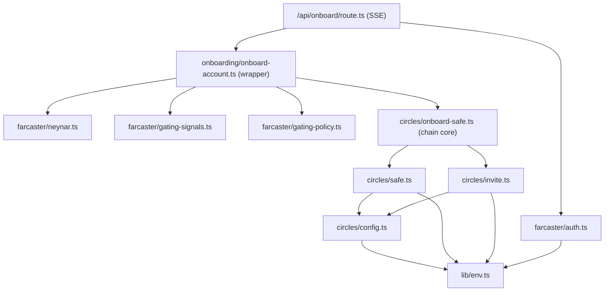

# Architecture

A map of how this repo is laid out and how a request flows through it. If you
are here to learn one of the two flows in depth, read the dedicated guides:

- [Farcaster mini app](./farcaster-mini-app.md) — SDK init, Quick Auth, manifest.
- [Circles invite + Safe](./circles-invite-and-safe.md) — Safe deploy, the invite farm, gating.

## Stack

- **Next.js 16** App Router (Turbopack), **React 19**, **TypeScript** strict.
- **Tailwind v4** + shadcn for the UI.
- **viem** for chain reads/writes; **@safe-global/protocol-kit** for Safe deploy + signing.
- **@aboutcircles/sdk-invitations** for the Circles invite farm.
- **@farcaster/miniapp-sdk** (client SDK) + **@farcaster/quick-auth** (server JWT verify).
- **Neynar v2** for the fid's verified addresses + anti-spam signals.
- Target chain: **Gnosis (chain 100)**. Circles lives on Gnosis.

## Where things live

```
app/
  page.tsx                     entry; renders <OnboardApp/>
  layout.tsx                   <head> metadata + fc:miniapp embed + fonts
  api/
    onboard/route.ts           POST: the onboard flow, streamed as SSE (auth -> deploy -> invite)
    verified-addresses/route.ts GET: the caller's verified eth addresses (signer picker)
    names/route.ts             POST: ENS / basename reverse resolution (cosmetic)
    debug/me/route.ts          GET: token + profile + gate verdict (dev only, no spend)
components/
  onboard-app.tsx              the single-screen client UI (all phases)
hooks/
  use-miniapp-sdk.ts           wraps @farcaster/miniapp-sdk: host detect, ready(), token, wallet
lib/
  env.ts                       env access + validation (single source of truth for config)
  circles/
    config.ts                  Gnosis contract addresses + Circles SDK wiring
    safe.ts                    predict / deploy / assert the user's Safe (deterministic address)
    invite.ts                  the invite farm: preflight, ensureInviterSetup, the atomic claim+transfer
    onboard-safe.ts            REUSABLE chain core: sequences safe+invite, emits progress; no Farcaster
  farcaster/
    auth.ts                    verifyQuickAuth: Bearer JWT -> { fid }
    neynar.ts                  verified addresses + profile via Neynar
    gating-signals.ts          free/keyless anti-spam signals (power badge, mutual follow)
    gating-policy.ts           turns signals + ONBOARD_GATE into allow/block
  onboarding/
    onboard-account.ts         thin Farcaster wrapper: auth/gate/owners, then calls onboard-safe
  types.ts                     shared API + domain types
public/.well-known/farcaster.json   the signed mini app manifest (per prod domain)
```

`lib/circles/config.ts` and `lib/circles/invite.ts` deliberately omit
`import "server-only"` because the `scripts/` tsx helpers import them in plain
Node. Everything else server-side keeps `server-only`.

## The onboard flow

One client tap calls `POST /api/onboard` with a Quick Auth JWT. The server owns
everything from there: it deploys the user's Safe with the operator's gas and
spends the house inviter's prepaid quota to register the user as a Circles human.
The user never signs a transaction or leaves the app. The route **streams**
progress back as Server-Sent Events, so the client's milestones reflect the real
on-chain step instead of a timer.

The flow is split in two: a thin **Farcaster wrapper** (`onboardAccount`) does
the fid-specific work (auth, owner re-validation, the anti-spam gate), then hands
a resolved owner set to the **reusable chain core** (`onboardSafeToCircles`),
which knows nothing about Farcaster, HTTP, or UI and emits semantic
`OnboardProgress` events as it goes.

```mermaid
sequenceDiagram
    autonumber
    participant U as User (in a Farcaster app)
    participant C as OnboardApp (client)
    participant R as /api/onboard (SSE)
    participant W as onboardAccount (Farcaster wrapper)
    participant K as onboardSafeToCircles (chain core)
    participant Gn as Gnosis chain

    U->>C: tap "Create my account"
    C->>R: POST { connectedAddress, additionalOwners } + Bearer JWT
    R->>R: verifyQuickAuth(JWT) -> { fid } (pre-stream; bad token = JSON 401)
    R->>W: onboardAccount({ fid, ..., onProgress })
    W->>W: resolve owners (wallet + re-validated verified addrs)
    W->>W: anti-spam gate (ONBOARD_GATE) — before any spend
    W->>K: onboardSafeToCircles({ owners }, onProgress)
    K->>Gn: predict Safe addr → emit "predicting"
    K->>Gn: Hub.isHuman(safe)? — idempotency short-circuit
    K->>Gn: preflight (read-only) → emit "preflight"
    K->>Gn: deploy + assertSafeReady → emit "deploying"/"verifying"
    K->>Gn: inviteSafe: claim+transfer (atomic) → emit "inviting"
    K->>Gn: poll Hub.isHuman ≤12×/2s → emit "registering"(attempt)
    K-->>W: ChainOnboardOutcome
    Note over R,C: each emit → `data: {type:"progress",...}` SSE frame
    W-->>R: OnboardOutcome → terminal `result` | `error` frame
    R-->>C: text/event-stream (HTTP 200; flow errors carry `code` in-band)
    C->>U: real milestones → "You're in." + Safe address + tx links
```

`onProgress` is a fan-out: the wrapper appends a `chain:` line to the debug
`steps[]` AND forwards the event to the route's SSE sink, so the dev `debug`
trail (`ONBOARD_DEBUG` / non-prod) and the user's milestones come from one source
and cannot drift. A faulty consumer can't stall the chain — the core try/catch
guards every `onProgress` call, and the route keeps the on-chain work running
even if the client disconnects (it just stops enqueuing).

## Module dependencies



The core (`onboard-safe.ts`) depends only on `circles/*` — no edge to
`farcaster/*`. That one-way boundary is what makes it reusable from a script,
CLI, or a different frontend; the wrapper is the only thing that knows about fids.

## Error model

`onboardAccount` returns a discriminated `OnboardOutcome` (`ok: true | false`).
On failure it carries a stable `code` that the route maps to an HTTP status in
`STATUS` (`app/api/onboard/route.ts`):

| code | status | meaning |
|------|--------|---------|
| `unauthorized` | 401 | missing/invalid Quick Auth token |
| `invalid_request` | 400 | bad `connectedAddress` |
| `gated` | 403 | failed the anti-spam gate |
| `no_quota` | 503 | house inviter is out of invites |
| `inviter_unavailable` | 503 | inviter not registered / preflight failed |
| `deploy_failed` | 500 | Safe deploy reverted |
| `safe_not_ready` | 500 | Safe deployed but missing modules/config |
| `invite_failed` | 500 | claim+transfer reverted |
| `not_registered` | 502 | txs sent but `isHuman` never flipped |
| `server_error` | 500 | anything else |

## Local commands

```bash
pnpm dev        # next dev --turbopack
pnpm build      # production build
pnpm typecheck  # tsc --noEmit
pnpm lint       # eslint
pnpm test       # vitest run
pnpm format     # prettier --write
```
