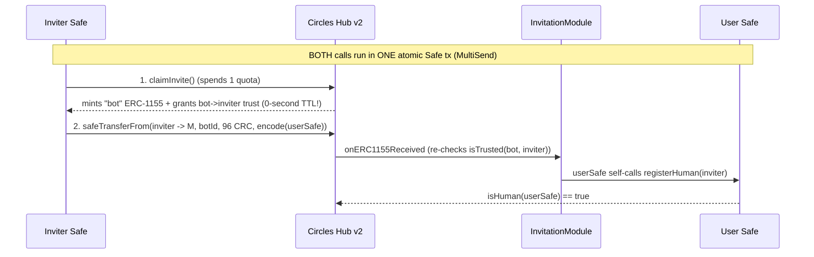

# Circles invite + Safe generation

How this app turns one tap into a registered Circles account: it deploys a Safe
smart account for the user and spends a prepaid invite to register that Safe as a
Circles "human", all backend-side, with the user signing nothing.

## Primer (skip if you know Circles + Safe)

- **Circles** is a personal-currency / UBI protocol on **Gnosis chain (100)**.
  Every registered "human" mints CRC over time. You become a human by being
  **invited by an existing human**. Docs: <https://docs.aboutcircles.com>.
- **Safe** is a smart-contract account (the former Gnosis Safe). A Circles v2
  account is a Safe with two specific modules enabled. Docs:
  <https://docs.safe.global>.
- **ERC-4337** is account abstraction. The user's Safe enables the Safe 4337
  module so it can be operated as a smart account. (Gasless sponsored deploy via
  Pimlico is an optional stretch; by default the operator EOA pays gas directly.)

## The actors

| Actor | What it is | Config |
|-------|-----------|--------|
| **Operator EOA** | A funded xDAI key that pays gas to deploy the user's Safe | `DEPLOYER_PK` |
| **House inviter Safe** | A Safe holding **prepaid invite quota** granted by the Circles team | `INVITER_SAFE_ADDRESS` (+ its owner key `INVITER_OWNER_PK`) |
| **User Safe** | The account this app creates and registers as a human | derived from the user's wallet address |

In the common case one EOA both deploys and owns the inviter Safe, so
`INVITER_OWNER_PK` defaults to `DEPLOYER_PK` (see `lib/env.ts`). The quota is the
scarce resource: you request it from the Circles team (see [SETUP](../SETUP.md)).

All contract addresses for chain 100 live in `lib/circles/config.ts` (Hub v2,
the invite farm, the invitation module, the Safe 4337 module, etc.).

## Step 1: Deterministic Safe address — `lib/circles/safe.ts`

The Safe address is derived deterministically from a fixed salt and the sorted
owner set, so the same user always maps to the same Safe. That is what makes the
whole flow **idempotent** (re-running never creates a second account).

```ts
export const SALT_NONCE = keccak256(encodePacked(["string"], ["farcaster-circles:onboard:v1"]));
// owners are checksummed, de-duped, and sorted (normalizeOwners) so ordering
// never changes the predicted address.
```

`buildAccountConfig` is the important part — a new Circles Safe is **not** a
plain Safe:

```ts
{ owners, threshold: 1,
  to: SAFE_MODULE_SETUP,        // delegatecall during setup...
  data: ENABLE_MODULES_DATA,    // ...enables [InvitationModule, Safe4337Module]
  fallbackHandler: SAFE_4337_MODULE }
```

- `predictUserSafe(owners)` — compute the address without deploying.
- `deployUserSafe(owners)` — deploy it (operator pays gas); no-op if already deployed.
- `assertSafeReady(addr, owners)` — verify version `1.4.1`, threshold 1, both
  modules enabled, fallback handler, and that every expected owner is on-chain.
  Run after deploy because a Safe can deploy yet be misconfigured.

## Step 2: The invite, and why it must be atomic — `lib/circles/invite.ts`

This is the subtle heart of the app. The invite uses the **invite farm**:

```ts
const { transactions } = await getInviteFarm().generateInvites(HOUSE_INVITER, [userSafe]);
// transactions === [claimTx, transferTx]
```

What those two transactions do, executed **as the inviter Safe**:



**The crux:** `claimInvite` self-grants the `bot -> inviter` trust with a
**0-second TTL** (it expires in the same block it was created). The follow-up
`safeTransferFrom` re-checks that trust. So the two calls **must execute in the
same transaction**. Split them across blocks and step 2 reverts
`TrustRequired(bot, inviter)` (selector `0xff1f28fc`, surfaced by Safe as
`GS013`).

This repo batches them with `execBatchAsInviterSafe`, which protocol-kit
executes as one MultiSend Safe transaction. (The Circles app does the equivalent
by batching them into a single 4337 UserOp.) This was a real bug: an earlier
version ran claim and transfer as two separate Safe txs and every invite failed
with `TrustRequired`. The fix was making them atomic.

Two more non-obvious things this file documents:

- **One-time inviter setup** (`ensureInviterSetup`): before an inviter Safe can
  spend quota, the InvitationModule must be enabled on it **and** it must
  `trustInviter`. The SDK returns exactly the missing setup txs (empty once
  done); idempotent.
- **`ExecutionSuccess` lies**: a Safe's `execTransaction` emits `ExecutionSuccess`
  even when the **inner** call reverts (it emits `ExecutionFailure` instead of
  bubbling). So a successful receipt is not proof the invite worked. That is why
  the orchestrator **polls `Hub.isHuman`** afterward instead of trusting the
  receipt.

## Step 3: Orchestration — `lib/onboarding/onboard-account.ts`

`onboardAccount` ties it together with a `log()` trail you can read in the debug
payload. Order matters for cost and correctness:

1. **Resolve owners** — the connected wallet is always an owner; the user may add
   verified addresses, each re-validated server-side against the fid's real
   verified set (a deselect is honored, arbitrary addresses are rejected).
2. **Gate** (`ONBOARD_GATE`) — runs **before any spend**, so a blocked user costs
   nothing. See gating below.
3. **Predict** the Safe address.
4. **Idempotency** — if `Hub.isHuman(safe)` is already true, return early.
5. **Preflight** (read-only) — `quota > 0` and the inviter is a registered human,
   **before** deploying, so a doomed onboard broadcasts nothing.
6. **Deploy** the Safe + `assertSafeReady`.
7. **Invite** — `ensureInviterSetup` then the atomic claim+transfer.
8. **Poll** `Hub.isHuman` up to 12 times every 2s (because the receipt can lie).

Each failure returns a stable error `code` (see the table in
[architecture](./architecture.md)).

## Gating — `lib/farcaster/gating-{signals,policy}.ts`

Optional anti-spam, free and keyless. `gating-signals.ts` gathers signals about
the fid (Warpcast power badge, whether the operator and the user mutually follow,
verified-address count) using a free hub, no paid API needed. `gating-policy.ts`
turns `ONBOARD_GATE` into an allow/block:

```
off | powerBadge | mutual | powerBadgeOrMutual | powerBadgeAndMutual
```

Default is `off` (allow everyone). `mutual` policies need the operator's own fid
in `DEBUG_VIEWER_FID`. `ONBOARD_ALLOWLIST_FIDS` always bypasses the gate.

## Reusing this in your own app

The Circles-specific logic is fully contained in `lib/circles/*` plus the env in
`lib/env.ts`. To run your own instance you need (a) your own inviter Safe with
quota granted by the Circles team and (b) a funded operator EOA. Everything else
(addresses, modules, the atomic batch) is the same. See [SETUP](../SETUP.md).
